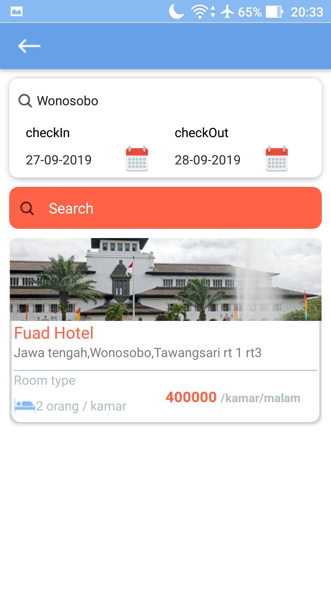

# HotBook 
## Description
  React native app for hotel bookings. users can explore, search and book hotel rooms with ease. Partners can manage services, and provide customer support directly through our chat feature
## Links
  - Backend : [HotBook API](https://api-hot-book.herokuapp.com)
  - Trello : [Trello](https://trello.com/b/tWFYtBhR/hotbook)
  - apk download : [HotBook.apk](https://drive.google.com/file/d/1sRZHMPs8dkF-2Sy9Axr9Qv9pq6wtp7jL/view?usp=sharing)
## Screenhots

